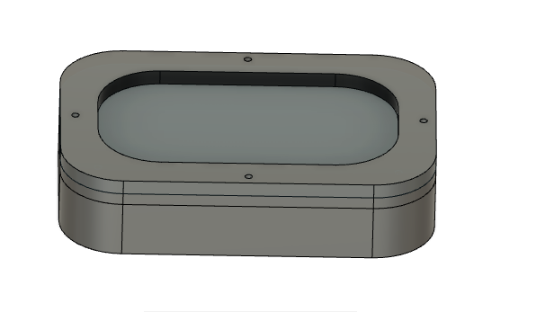

# Rakshak

 application which will be a GPS tracker connected to an ambulance. In many situations we have seen that the ambulance doesn't reach some places on time as the place might be difficult to find, so by creating an application through which the ambulance and the person called for ambulance gets and idea of where the ambulance is and not only that application tells you where the ambulance is but until it arrives it also tells you what first aid can you give it to the patient at the moment so as to keep the person alive until he reaches the hospital.

### Unique Selling Points

* Point 1. it has a GPS locator, so the person called in for an ambulance can track where the ambulance is.
* Point 2. It tells you some First Aid that can be provided to the patients
* Point 3. This can work even in remote areas as it is inked with the google maps
* Point 4. This also shows how much time will it take to reach the patient

## Implementation: 
Enter the details, the details would be given to the nearest ambulance then the website will show the fastest direction for the ambulance to reach the victim in the mean time it will show the first aid that can be given to the patient.
## Technology Stack  

### Tech1

fusion360

### Tech2

aruduino 

### Tech3

WebDev

## Picture/Screenshot 1

## Picture/Screenshot 2

## Picture/Screenshot 3

  

## Challanges
Implementation was difficult due to constraint on hardware usage.

## Getting Started

https://makertanay.github.io/Hackverse2.0/

## Future Aspects

Implementation with Hardware

## Authors
* [**Tanay**]https://github.com/makertanay
* [**Kaustubh**]https://github.com/kaustubhmohta
* [**Gauri**]https://github.com/kodekandy
 
